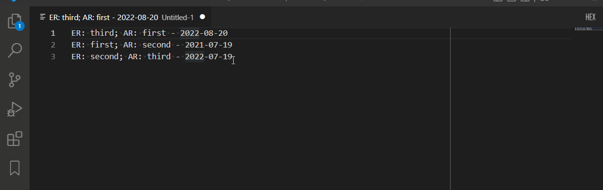

# vscode-sort-by-date

Adds "Sort Selection By Date" command.

1. Select date substring on different lines
2. Call "Sort Selection By Date" command
3. Lines will sort by date (ASC)

## Limitations

* Only ISO8601 dates
* Only one selection per line
* Only ASC sorting